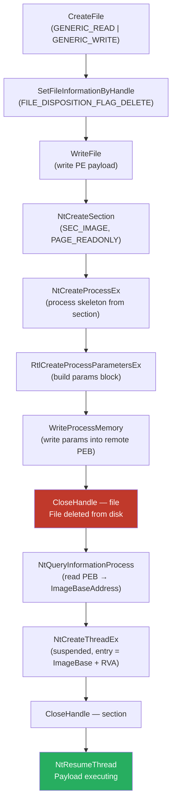

# PeekABoo

> Windows x64 only

A working proof-of-concept for **Process Ghosting** — a technique where you execute a PE entirely from memory by deleting it off disk before the process even starts. No file for AV to scan, no path that resolves to anything real.

This exists so blue teams can understand exactly what's happening under the hood and build detections around it. If that's not what you're doing with it, don't use it.

---

## How it works

The trick exploits a quirk in how Windows handles file deletion. When you mark a file for deletion with `FILE_DISPOSITION_FLAG_DELETE`, Windows doesn't actually delete it immediately — it just queues the deletion for when the last handle closes. In the meantime, the file is inaccessible to new opens but your handle stays valid.

That window is what we exploit:

1. Create a temp file and immediately mark it for deletion
2. Write your PE payload into it
3. Call `NtCreateSection` with `SEC_IMAGE` — the kernel maps the PE into a section object backed by the file
4. Call `NtCreateProcessEx` with the section — you now have a live process object
5. Write process parameters into the new process's PEB (without this the loader crashes on startup)
6. Close the file handle — file disappears from disk, process doesn't care
7. Create a suspended thread at `ImageBase + EntryPointRVA`
8. Resume the thread — payload runs

By step 6, there's nothing on disk. The section object holds a reference to the image in memory. Scanners looking for a file path get nothing.



---

## The part most PoCs get wrong

A bare `NtCreateProcessEx` call gives you a process skeleton with no loader state. The PEB's `ProcessParameters` pointer is null. When the thread starts, `ntdll!LdrInitializeThunk` tries to read the image path, working directory, and environment from that pointer and crashes immediately.

You have to manually build an `RTL_USER_PROCESS_PARAMETERS` block with `RtlCreateProcessParametersEx`, allocate space for it in the remote process, write it in, and patch `PEB.ProcessParameters` before the thread ever runs. This is handled in `ProcessExecutor::SetupProcessParameters`.

The other thing: `winternl.h` only exposes a stub of `RTL_USER_PROCESS_PARAMETERS` with two fields. The real struct has a dozen embedded `UNICODE_STRING` members that need to be rebased if you can't allocate the params block at the same VA as the local copy. The full layout lives in `Common.hpp`.

---

## Handle ordering

The timing here matters. Get it wrong and either the section creation fails or the file isn't actually deleted:

```text
CreateFile → [file handle open]
  └─ SetFileInformationByHandle (mark for deletion)
  └─ WriteFile (write payload)
  └─ NtCreateSection → [section handle open]
       └─ NtCreateProcessEx → [process handle open]
            └─ RtlCreateProcessParametersEx / WriteProcessMemory
            └─ CloseHandle(file) ← ghosting happens here
            └─ NtCreateThreadEx (suspended) → [thread handle open]
            └─ CloseHandle(section)
            └─ NtResumeThread ← payload starts executing
            └─ CloseHandle(thread)
            └─ CloseHandle(process)
```

The file handle has to stay open through `NtCreateSection`. Close it before that and the section has nothing to back it. Close it after the thread resumes and the file is still on disk when the process starts — defeating the whole point.

---

## Code structure

| Module | What it does |
| --- | --- |
| `Common.hpp` | Shared types: `NTSTATUS`, `NT_SUCCESS`, the full `RTL_USER_PROCESS_PARAMETERS` layout, `DynamicNT` singleton that resolves all NT function pointers from `ntdll.dll` at startup |
| `PayloadManager` | Loads a PE from disk, validates MZ/PE signatures, extracts the entry point RVA — handles both PE32 and PE32+ |
| `FileGhoster` | Creates the temp file, marks it for deletion, writes the payload, closes the handle |
| `SectionManager` | Wraps `NtCreateSection` with `SEC_IMAGE` |
| `ProcessExecutor` | Everything after section creation: process skeleton, PEB parameter setup, image base resolution, thread creation, resume |
| `ErrorHandler` | Centralized logging (`GetLastError` and NTSTATUS both resolved to strings via `FormatMessageA`), safe handle cleanup |

---

## Detection

If you're on the blue side, here's where to look:

- **`NtCreateSection` on a deletion-pending file handle** — this is the definitive signature. File has `FILE_DISPOSITION_FLAG_DELETE` set and someone is creating an image section from it. No legitimate software does this.
- **Process with no backing file** — at process creation time, the PEB `ImagePathName` resolves to a path that doesn't exist. ETW's `Microsoft-Windows-Kernel-Process` provider fires events you can correlate with file deletion timestamps.
- **`NtCreateProcessEx` called directly** — normal processes go through `CreateProcess`. Anything calling `NtCreateProcessEx` from userland is worth a look.
- **In-memory scanning** — the file is gone but the image is still mapped. Memory scanners can still match signatures against the mapped sections.

A kernel driver using `PsSetCreateProcessNotifyRoutineEx` can check at process-creation time whether the backing image file is openable. If it's already deleted, flag it.

---

## Building

Requires Windows 10 1809+ (RS5) for `FILE_DISPOSITION_INFO_EX`. Anything older won't compile.

### CMake

```bat
cmake -B build -A x64
cmake --build build --config Release
```

Output: `build\Release\PeekABoo.exe`

### Visual Studio

1. New empty C++ project, platform x64, configuration Release
2. Add `src\` as source files, `include\peek-a-boo\` as additional include directory
3. Character set: Unicode
4. Build

---

## Usage

```bat
PeekABoo.exe <payload.exe> [ghost_path]
```

`ghost_path` defaults to `C:\Windows\Temp\ghost_payload.bin` if not specified.

For a quick smoke test, copy any system binary (`notepad.exe`, `calc.exe`) as your payload. If it launches, the chain worked.

---

## Disclaimer

This is for research and authorized testing only. Don't run it against systems you don't own or have explicit written permission to test. The authors take no responsibility for what you do with it.
